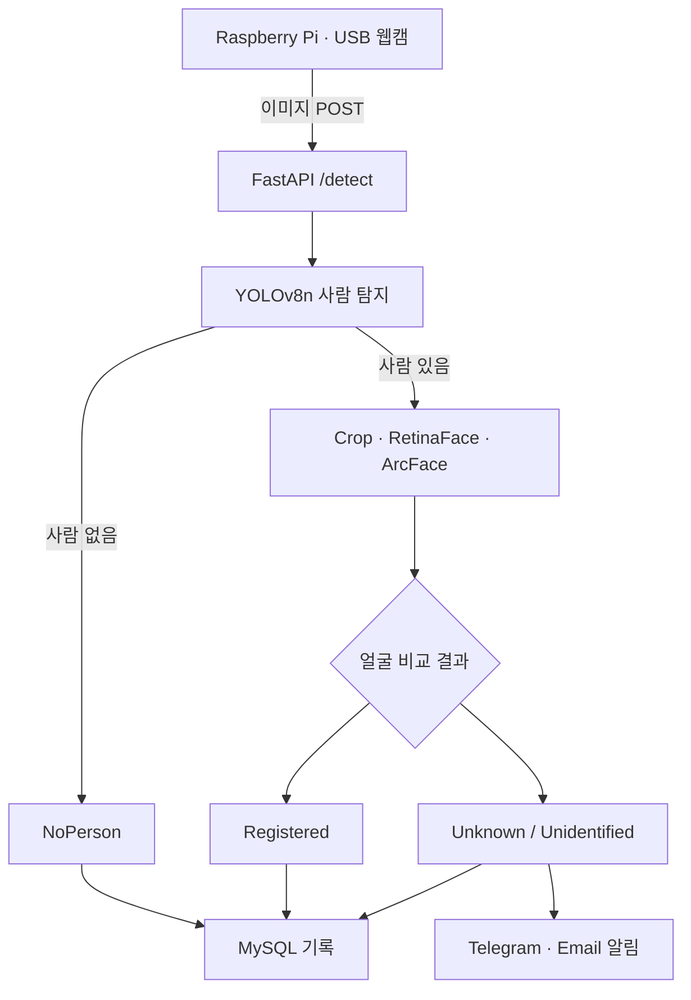

# 실내 보안 탐지 시스템

**Raspberry Pi · FastAPI · YOLOv8n · DeepFace ArcFace**

USB 웹캠으로 촬영한 이미지를 서버로 전송하고, 사람 탐지와 등록 얼굴 비교를 거쳐 결과를 기록·알림으로 전달하는 캡스톤디자인 프로젝트입니다. 확실한 등록 인물, 판별이 애매한 인물, 미등록 인물을 구분해 확인이 필요한 상황을 알립니다.

주기적인 이미지 업로드 방식으로 동작합니다. 현재 서버 코드는 연속 영상 스트리밍 서버가 아니며, `Unknown`은 등록 얼굴과의 비교 결과이지 실제 침입 여부를 확정하는 판정은 아닙니다.

## 프로젝트와 담당 역할

| 구분 | 내용 |
|---|---|
| 형태 | 3인 팀 캡스톤디자인 |
| 공개 개발 기록 | 2026년 3월~6월 보고서 8편 |
| 오석준 담당 | 팀장, Python·FastAPI 서버 처리, YOLO 모델 비교·연동, 얼굴 인식 모델 관리, Telegram·이메일 알림 |
| 협업 범위 | Raspberry Pi 촬영·전송, 데이터베이스·데이터 관리, 전체 시스템 통합 |
| 저장소 범위 | 최종 서버 코드, 실행 설정 예시, DB 스키마 예시, 개발 보고서, 초기 스트리밍 설명 영상 |

## 주요 기능

- `POST /detect`로 이미지 수신 후 YOLOv8n의 person 클래스 탐지
- 사람 영역을 전체·상반신 crop으로 나눠 RetinaFace로 얼굴 검출
- ArcFace 임베딩과 cosine distance를 이용한 등록 얼굴 비교
- 서버 시작 시 등록 얼굴 임베딩 캐싱
- 판별 결과·이벤트의 MySQL 저장과 이미지·알림 로그 보관
- 확인이 필요한 이벤트에 Telegram 사진 알림과 이메일 전송
- 알림 전송을 별도 스레드로 처리하고 이벤트 종류별 쿨다운 지원

## 시스템 구조



Crop 실패는 별도의 `CropFailed` 이벤트로 처리합니다. 세부 API·예외 동작은 [기술 문서](docs/TECHNICAL.md)를 참고하세요.

## 얼굴 판별 기준

거리값이 작을수록 등록 얼굴 임베딩과 유사합니다. 아래 기준은 프로젝트 실험에 맞춘 설정이며, 일반적인 인식 정확도를 보증하는 기준은 아닙니다.

| 조건 | 결과 | 이벤트 | 알림 대상 |
|---|---|---|---|
| distance < 0.30 | `Registered` | `NORMAL_ACCESS` | 아니요 |
| 0.30 ≤ distance < 0.47 | `Unidentified` | `FACE_NOT_IDENTIFIED` | 예 |
| distance ≥ 0.47 | `Unknown` | `UNKNOWN_PERSON_DETECTED` | 예 |
| 얼굴 검출·비교 불가 또는 등록 임베딩 없음 | `Unidentified` | `FACE_NOT_IDENTIFIED` | 예 |
| YOLO 탐지 결과 없음 | `NoPerson` | `NO_PERSON` | 아니요 |
| 사람 영역 crop 생성 실패 | `CropFailed` | `CROP_FAILED` | 예 |

알림 대상이어도 해당 채널의 환경변수와 활성화 설정이 있어야 실제 발송됩니다.

## 모델 선택과 실험 기록

YOLOv8n과 YOLOv8s의 사람 탐지 결과·처리 속도를 비교한 뒤 반복적인 서버 분석에 사용할 모델로 YOLOv8n을 선택했습니다. 얼굴 분석에는 RetinaFace 검출기와 ArcFace 임베딩을 사용하고, 단일 경계값 대신 중간 구간을 두어 애매한 결과를 관리자 확인 대상으로 분리했습니다.

2026-06-02 보고서에 기록된 서버 처리 시간은 다음과 같습니다. 새로운 벤치마크 결과나 평균값이 아니라 당시 실험의 관찰 범위입니다.

| 처리 조건 | 보고서 기록 |
|---|---|
| 사람 미탐지 | 약 0.15~0.65초 |
| 등록 인물 탐지 | 약 6~10초 |
| 미등록 인물 탐지 | 약 7~10초 |

사람이 있는 경우 얼굴 분석이 포함되어 처리 시간이 증가합니다. 촬영 간격을 3초로 설정하더라도 전체 처리 주기가 항상 3초인 것은 아닙니다. 정확도 백분율이나 표준 벤치마크 수치는 별도로 제시하지 않습니다.

## 파일 구성

| 경로 | 설명 |
|---|---|
| `server_realtime.py` | 최종 FastAPI 분석 서버 |
| `.env.example` | 실제 자격 증명이 없는 설정 예시 |
| `requirements.txt` | 서버 import 기준 의존성 목록 |
| `sql/schema.sql` | 현재 INSERT 구문에 맞춰 작성한 개발용 테이블 예시 |
| `docs/SETUP.md` | 설치, 얼굴 등록, DB·알림 설정, 실행 방법 |
| `docs/TECHNICAL.md` | API, 처리 상세, 현재 제약 사항 |
| `docs/reports/` | 기존 개발 보고서 8편과 목차 |
| `docs/media/` | 기존 mjpg-streamer 설명 영상 |

## 빠른 실행

기존 실험 환경의 패키지 버전 목록은 제공되지 않았습니다. `requirements.txt`는 버전이 고정된 재현 환경이 아니며, 설치 후 대상 환경에서 호환성을 확인해야 합니다.

```bash
git clone https://github.com/seokjoon-oh/cctv.git
cd cctv
python -m venv .venv
```

Windows PowerShell:

```powershell
.\.venv\Scripts\Activate.ps1
python -m pip install -r requirements.txt
Copy-Item .env.example .env
New-Item -ItemType Directory -Force registered_faces/person01
```

Linux / macOS:

```bash
source .venv/bin/activate
python -m pip install -r requirements.txt
cp .env.example .env
mkdir -p registered_faces/person01
```

1. 본인이 사용 권한을 가진 등록 얼굴 사진을 `registered_faces/person01/`에 넣습니다.
2. 기존 실험에 사용한 `yolov8n.pt`를 프로젝트 루트에 배치합니다. 모델 가중치는 Git에 포함하지 않습니다.
3. 프로젝트 루트에서 `python server_realtime.py`를 실행합니다.
4. `http://127.0.0.1:8000/docs`에서 `/health`와 `/detect`를 확인합니다.

초기 설정 예시는 DB·Telegram·이메일을 모두 비활성화합니다. 실제 연동은 [실행 안내](docs/SETUP.md)를 따릅니다. DeepFace 모델 준비 시 추가 다운로드가 필요할 수 있습니다.

## 개발 기록

[보고서 목차](docs/reports/README.md)에서 계획 수립, 장치·통신 환경 구축, 모델 비교, 얼굴 판별, DB·알림 연동, 최종 통합 과정을 확인할 수 있습니다.

초기 계획의 ROI 진입 판정·체류 시간 분석·웹 로그 UI는 현재 공개 서버에 구현된 기능으로 표시하지 않았습니다. 초기 mjpg-streamer 영상도 최종 얼굴 판별 파이프라인의 통합 시연 영상과 구분합니다.

## 공개 범위와 현재 한계

- 실제 `.env`, 등록 얼굴 사진, 탐지 결과 이미지·로그, 모델 가중치는 업로드 대상에서 제외합니다.
- Raspberry Pi 촬영 클라이언트의 독립 실행 파일은 현재 저장소에 포함되지 않습니다. 보고서에 촬영·전송 방식이 설명되어 있습니다.
- 현재 `ALERT_COOLDOWN_SEC = 0`으로 쿨다운 제한이 없습니다. 필요하면 코드의 값을 변경합니다.
- 동기 추론을 수행하는 실험용 서버이며, 인증·업로드 크기 제한·파일명 안전화·작업 큐·데이터 보관 정책 등을 운영 환경에 맞게 보완해야 합니다. 신뢰할 수 있는 실험 네트워크에서 사용합니다.
- 얼굴이 작거나 가려진 경우, 표정·조명·각도가 다른 경우 결과가 달라질 수 있습니다.


