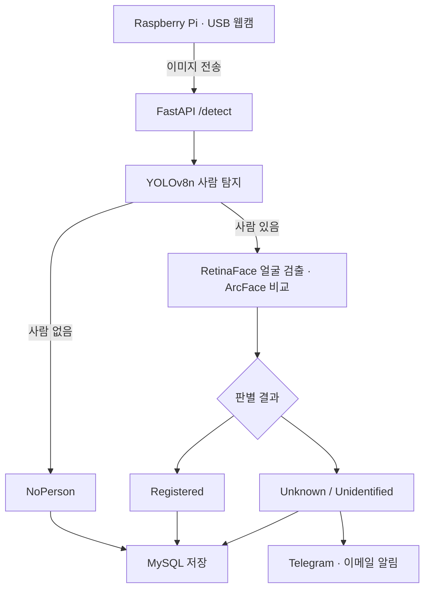

# 실내 보안 탐지 시스템

Raspberry Pi에 연결한 USB 웹캠으로 실내를 촬영하고, 서버에서 사람을 탐지한 뒤 등록된 얼굴과 비교하는 캡스톤디자인 프로젝트입니다. 판별 결과는 MySQL에 저장하고, 미등록 인물이거나 얼굴을 식별하기 어려운 경우 Telegram과 이메일로 알림을 보냅니다.

**사용 기술:** Python, FastAPI, YOLOv8n, DeepFace(ArcFace), RetinaFace, OpenCV, MySQL

## 담당 역할

3인 팀의 팀장으로 서버 처리, 얼굴 인식 모델 관리, Telegram·이메일 알림 기능을 맡았습니다. YOLOv8n과 YOLOv8s를 비교하고, 얼굴 판별 결과를 확인하면서 임계값을 조정했습니다. 팀원들과는 Raspberry Pi 촬영·전송, DB·데이터 관리 역할을 나눠 진행했습니다.

## 동작 방식

Raspberry Pi가 일정 간격으로 이미지를 촬영해 FastAPI 서버의 `/detect`로 전송합니다. 서버는 YOLOv8n으로 사람을 찾고, 해당 영역에서 얼굴을 검출해 등록 얼굴과 비교합니다.



등록 얼굴의 임베딩은 서버 시작 시 미리 계산해 둡니다. 입력 이미지에서는 사람 영역 전체와 상반신을 각각 잘라 얼굴을 비교하고, 등록 얼굴과의 cosine distance가 가장 작은 결과를 사용합니다. 알림 전송은 별도 스레드에서 처리합니다.

## 얼굴 판별 기준

테스트 중 등록 인물과 미등록 인물의 거리값이 일부 겹치는 경우가 있었습니다. 이를 바로 등록·미등록으로 나누기보다, 애매한 구간은 `Unidentified`로 두고 확인할 수 있도록 했습니다.

거리값은 작을수록 등록 얼굴과 유사하며, 현재 코드의 기준은 다음과 같습니다.

| 거리값 | 판별 결과 | 처리 |
|---|---|---|
| 0.30 미만 | `Registered` | 정상 접근으로 기록 |
| 0.30 이상 0.47 미만 | `Unidentified` | 확인 필요 알림 |
| 0.47 이상 | `Unknown` | 미등록 인물 알림 |

얼굴 검출이나 비교에 실패한 경우도 `Unidentified`로 처리합니다. 사람이 없으면 `NoPerson`, 사람 영역을 잘라내지 못하면 `CropFailed`로 기록하며, `CropFailed`도 알림 대상입니다.

임계값은 당시 촬영 환경에서 테스트하며 정한 값입니다. `Unknown`은 등록 얼굴과 다르다는 판별 결과이므로 실제 침입 여부는 알림을 받은 뒤 확인해야 합니다.

## 모델 비교와 처리 시간

YOLOv8n과 YOLOv8s를 비교한 뒤, 반복적으로 이미지를 처리하는 서버에는 속도가 더 빠른 YOLOv8n을 사용했습니다. 얼굴 검출에는 RetinaFace, 얼굴 특징 비교에는 ArcFace를 적용했습니다.

아래는 2026년 6월 2일 보고서에 기록한 서버 처리 시간 범위입니다.

| 상황 | 처리 시간 |
|---|---|
| 사람 미탐지 | 약 0.15~0.65초 |
| 등록 인물 탐지 | 약 6~10초 |
| 미등록 인물 탐지 | 약 7~10초 |

사람이 탐지되면 얼굴 분석까지 수행해 시간이 더 걸렸습니다. 촬영 간격은 3초로 설정했지만 서버 응답을 기다리는 시간이 있어, 실제 처리 주기는 이보다 길어질 수 있습니다.

## 실행 방법

```bash
git clone https://github.com/seokjoon-oh/cctv.git
cd cctv
python -m venv .venv
```

Windows PowerShell:

```powershell
.\.venv\Scripts\Activate.ps1
python -m pip install -r requirements.txt
Copy-Item .env.example .env
New-Item -ItemType Directory -Force registered_faces/person01
```

Linux / macOS:

```bash
source .venv/bin/activate
python -m pip install -r requirements.txt
cp .env.example .env
mkdir -p registered_faces/person01
```

1. 사용 권한이 있는 등록 얼굴 사진을 `registered_faces/person01/`에 넣습니다.
2. `yolov8n.pt`를 프로젝트 루트에 배치합니다.
3. 루트에서 `python server_realtime.py`를 실행합니다.
4. `http://127.0.0.1:8000/docs`에서 API를 확인합니다.

`.env.example`은 DB와 알림 기능을 꺼 둔 상태입니다. 연결 정보를 입력하고 필요한 기능을 `True`로 바꾸면 됩니다. 자세한 설정은 [실행 안내](docs/SETUP.md)에 정리했습니다.

`requirements.txt`는 패키지 버전을 고정하지 않아 설치 환경에 따라 호환성 확인이 필요합니다. DeepFace 모델은 처음 실행할 때 추가로 다운로드될 수 있습니다.

## 파일 구성

| 파일·폴더 | 내용 |
|---|---|
| `server_realtime.py` | 이미지 수신, 사람 탐지, 얼굴 비교, 결과 저장·알림 |
| `.env.example` | DB·Telegram·이메일 설정 예시 |
| `requirements.txt` | 서버 실행에 필요한 패키지 |
| `sql/schema.sql` | 서버의 INSERT 구문에 맞춘 테이블 생성 예시 |
| `docs/SETUP.md` | 설치 및 실행 방법 |
| `docs/TECHNICAL.md` | API와 세부 처리 방식 |
| `docs/reports/` | 2026년 3월~6월 개발 보고서 8편 |
| `docs/media/` | 초기 mjpg-streamer 설명 영상 |

DB 스키마는 원본 DB를 추출한 파일이 아니라 실행을 위한 예시입니다. 실제 `.env`, 얼굴 사진, 탐지 결과, 모델 가중치는 저장소에 포함하지 않았습니다. Raspberry Pi 촬영 클라이언트 코드는 별도 파일로 포함되어 있지 않으며, 촬영·전송 과정은 보고서에 설명되어 있습니다.

## 보완할 점

얼굴이 작거나 가려져 있거나, 촬영 각도·표정·조명이 달라지면 `Unidentified`로 분류되는 경우가 있었습니다. 등록 사진을 다양하게 확보하고, 여러 프레임의 결과를 함께 판단하는 방식으로 개선할 수 있습니다. 얼굴 분석에 수 초가 걸리는 점도 개선이 필요합니다.

현재 서버는 실험용으로, 이미지 분석과 DB 저장을 순서대로 처리합니다. 여러 요청을 동시에 처리하거나 외부에 공개하려면 작업 큐, 인증, 업로드 제한 등을 추가해야 합니다. 알림 쿨다운은 현재 `ALERT_COOLDOWN_SEC = 0`으로 설정되어 있습니다.

초기 계획에 있던 ROI 진입 판정, 체류 시간 분석, 웹 로그 UI는 현재 코드에 포함되어 있지 않습니다. mjpg-streamer 영상은 초기 스트리밍 환경을 설명한 자료이며, 최종 서버는 이미지를 주기적으로 받아 분석하는 방식입니다.

## 개발 보고서

[보고서 목록 보기](docs/reports/README.md)

환경 구축부터 통신 연결, 모델 비교, 얼굴 인식, DB·알림 연동까지 진행한 내용을 날짜별로 정리했습니다.
